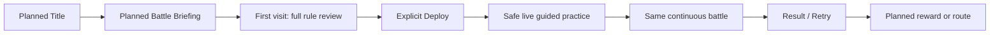

# Tetris · Master GDD

- Status: `CURRENT_READER_GDD / CANONICAL_SYNTHESIS`, Issue #72
- Fresh gameplay source snapshot: `origin/main` `dec60706ab8fcec3986b01f279d9d60080a309f8`, read 2026-08-28; repository-only owner migration snapshot: `origin/main` `59c537f29ed0bebed8d40be5cecfd6ff5b89318b`.
- Purpose: make the currently approved game intelligible in one place without replacing the documents and runtime evidence that own individual facts.
- Reader rule: a rule may be **approved** yet not be **implemented**; an implemented system may be automated-tested yet not be **Human/player validated**. This document preserves those distinctions.
- Current owner rule: GitHub repository documents, GitHub issue/PR history, and runtime evidence are the sole current project owners. Notion is `HISTORICAL_EXTERNAL_PROVENANCE_ONLY`; do not read, write, sync, or require it for current work.

> This is a navigation and synthesis owner, not a license to overwrite detailed owners. When a detailed source and this GDD disagree, resolve it at the detailed owner, correct this synthesis, and record the conflict.

## 1. Source registry and authority

| Owner | What it owns | Fresh-read state |
| --- | --- | --- |
| `docs/design/PRODUCTION_CANON_INDEX.json` | Current decision IDs, authority order, machine-readable current/actual boundary | `CURRENT` |
| `docs/design/PRODUCTION_REALTIME_COMBAT_CANON.md` | `TETRIS-CORE-029`: continuous battle, workspace and pause grammar | `CURRENT` |
| `docs/design/CHAIN_COMBO_MP_CONTRACT.md` | `TETRIS-CHAIN-038`: CHAIN match, MP lock, Combo and recovery formula | `CURRENT` |
| `docs/design/VANGUARD_TACTICAL_SKILL_MATRIX.md` and `DUAL_RESOURCE_TIER_EXPOSURE_CONTRACT.md` | Technique and dual-resource meaning | `CURRENT` |
| `docs/design/FIRST_SESSION_ONBOARDING_CONTRACT.md` | `TETRIS-ONBOARDING-037`: briefing and safe live tutorial intention | `CURRENT / DOCUMENTED_NOT_IMPLEMENTED` |
| `docs/design/RUNTIME_IMAGE_ASSET_CONSUMER_CONTRACT.md` | Runtime consumer and image-generation/lock workflow | `CURRENT` |
| `docs/design/FULL_GAME_SCREEN_SURFACE_INVENTORY.md` | Current and planned screen coverage | `CURRENT` |
| `scenes/production/battle.tscn`, `src/production/**`, `data/production/**` | Actual merged-main Godot scene, code and seed data | `CURRENT IMPLEMENTATION EVIDENCE` |
| `tests/production/**`, `tests/tooling/**`, exact-head CI/runtime receipts | Automated evidence only | `CURRENT / EVIDENCE-BOUNDED` |
| `docs/design/PROJECT_MASTER_GDD.md`, `VISUAL_BIBLE.md`, screen/asset manifests and GitHub issue/PR history | Human-facing project organization, visual direction and decision readback | `CURRENT REPOSITORY OWNER` |
| Previous Notion pages | External historical context only | `HISTORICAL_EXTERNAL_PROVENANCE_ONLY / DO_NOT_SYNC` |
| Open/draft PRs #19, #23, #33, #46 | Parallel historical/proposed workstreams | `READ_ONLY / NOT CURRENT TRUTH` |
| `CORE_GAMEPLAY_GDD.md`, POC rules and prior turn-time docs | Provenance only | `HISTORICAL` or `SUPERSEDED` as indexed |

### Canonical labels

| Label | Meaning in this GDD |
| --- | --- |
| `CURRENT` | Approved and current owner; not necessarily implemented. |
| `IMPLEMENTED` | Present on the fresh merged main. |
| `PARTIAL` | Some approved behavior exists, but a material remainder does not. |
| `HISTORICAL` | Useful provenance; not a current requirement. |
| `SUPERSEDED` | Explicitly replaced; must not re-enter UI, design, or implementation by accident. |
| `CONFLICT` | Current sources disagree or a current statement conflicts with actual evidence. |
| `UNKNOWN_UNVERIFIED` | Not proved by a fresh owner, code/data, test/runtime receipt, or Human/player receipt. |

### Resolved and remaining conflict register

| Class | Finding | Current disposition |
| --- | --- | --- |
| `SUPERSEDED` | Ordered LINE→CHAIN→enemy turns, shared player-turn budget, READY/pass flow, timeout and Tempo language | `TETRIS-CORE-024` / `TETRIS-TIME-025` are provenance only. CORE-029 continuous realtime replaces them. |
| `HISTORICAL` | `CORE_GAMEPLAY_GDD.md` describes earlier Energy/Stock and board concepts | Foundation reference only; it cannot define current player-facing rules. |
| `CONFLICT` | Approved CHAIN requires both diagonals, 1-MP lock, 60 MP cap, 10 Combo cap and per-wave formula; current code has `STOCK_CAP = 6`, H/V-only matching, forced no-match restore and legacy depth rewards | `TETRIS-CHAIN-038` is `PARTIAL_HV_ONLY_NO_MP_LOCK_NO_MP_CAP_LEGACY_DEPTH_REWARD`; Phase 2 review is required before Godot implementation. |
| `PARTIAL` | Battle runtime enters directly into continuous battle, while the approved first session requires briefing → Deploy → short guided live practice → same encounter | First-session contract is `USER_APPROVED_DOCUMENTED_NOT_IMPLEMENTED`. |
| `UNKNOWN_UNVERIFIED` | Dedicated repository Audio Contract file | `VISUAL_BIBLE.md` is the repository visual owner. Audio has only pause-bridge support; a player-facing audio plan and evidence remain unknown. |
| `UNKNOWN_UNVERIFIED` | User-Windows play, target-resolution composite readability, first-exposure comprehension, tension, balance, accessibility and player appeal | **Human/player evidence: NOT_RUN**. Automated/scene-equivalent checks do not prove any of these. |

## 2. One-page game promise

### Player promise

**At a Frontier Gate, read a live Gatebreaker threat, decide whether to prepare MP with LINE or Combo with CHAIN, then pause only to make a deliberate Vanguard Technique commitment before the same danger resumes.**

Combat time is `CONTINUOUS_REALTIME`: the live clock begins at Deploy, and no ordered turn rail, shared player-turn budget or hidden READY handoff returns.

```text
Live Telegraph + ETA
→ choose a persistent puzzle workspace
→ LINE clear earns MP / CHAIN resolution earns shared Combo and MP recovery
→ decide: spend Combo on an urgent Technique or preserve it for Tier access and later CHAIN MP recovery
→ open Skill to fully pause, inspect ATK / DEF / SUP and Tier 1–6
→ explicit USE commits, feedback changes the battle, realtime resumes
→ read the next threat and revise the next preparation
```

| Link in the experience | Current intended meaning |
| --- | --- |
| Representative action | Switch freely between one large LINE or CHAIN workspace, manipulate it under pressure, then make an explicit Skill use. |
| Meaningful choice | Immediate MP versus future Combo; solve the current threat versus set up the next; spend Combo now versus preserve stronger Tier and future CHAIN recovery; restore a failed swap versus spend fixed 1 MP to lock its setup. |
| Observable result | Clear/recovery, Combo change, telegraph/ETA, Technique outcome and the next enemy action are visible in the same battle context. |
| Reward and failure learning | Valid CHAINs grow the one shared Combo resource; a no-match restores by default and resets Combo, while MP lock deliberately keeps the board but also resets Combo with no immediate reward. Defeat/retry exists; causal learning quality is not yet Human-validated. |
| Target emotion and memory | “I spotted the threat, built the right resource and chose exactly when a strong move was worth it.” Pressure should feel readable, not like hidden turns or speed-only execution. |
| Next-action motive | A changed telegraph and resource state pose the next preparation/commitment question; planned result/meta loops are not yet proof. |
| Differentiation / sales hook | Not simply puzzle combat: two non-interchangeable puzzles create a live preparation dilemma, then a fair full pause turns reaction pressure into intentional tactical commitment. |

### Project goal and Work-5 position

| Work stage | Status | Evidence ceiling and next gate |
| --- | --- | --- |
| 1. Core promise, economy and visual direction | `CURRENT / USER_APPROVED` | CORE-029, CHAIN-038, VISUAL-028 and ONBOARDING-037 are defined. |
| 2. Representative continuous-battle slice | `IMPLEMENTED / PARTIAL` | 60/40 battle, persistent workspaces, scheduler, pause, skill and named art consumers exist. CHAIN-038 and onboarding remain incomplete. |
| 3. Human usability / player experience | `NOT_RUN` | The immediate required validation gate: target-resolution capture and first-exposure observation. |
| 4. First-session and session-completion loop | `DESIGNED / NOT_IMPLEMENTED` | Briefing/tutorial is approved; result/reward/route/meta remain planned. |
| 5. Production expansion and polish | `DEFERRED` | Start only after Stage 3 evidence identifies the smallest necessary correction. |

**Active Playable Slice:** one Gatebreaker encounter in `scenes/production/battle.tscn`, direct-entry continuous battle, with LINE, CHAIN, live telegraph/ETA, tactical Skill pause and retry. It is not yet the approved first-time-player flow.

## 3. Core loop, systems and content

### Core, session and meta loops

| Loop | Status | Player flow |
| --- | --- | --- |
| Core combat loop | `CURRENT / IMPLEMENTED BASELINE` | Read ETA → choose LINE/CHAIN → gain/prep resource → pause for deliberate Technique commitment → resolve response → read next ETA. |
| Intended first-session loop | `CURRENT / NOT_IMPLEMENTED` | Short Vanguard/Frontier Gate/Gatebreaker threat explanation → full economy-critical rule review → Deploy → safe live guided practice → seamless normal battle → result/retry. |
| Full-session loop | `PARTIAL` | Planned title/loadout/route/briefing/battle/result surfaces exist as references; no route, persistence or reward data is implemented. |
| Progression/meta loop | `UNKNOWN_UNVERIFIED` | Route, workshop, persistent reward, unlock and long-run motivation must not be inferred from planned screen references. |

### System contract register

| System | Player-facing rule | Approved / actual state | Implementation owner |
| --- | --- | --- | --- |
| `SYS-CORE-029` Continuous battle | Enemy time runs after Deploy; encounter ends at victory/defeat; no old turn rail. | `CURRENT`; direct-entry realtime runtime is implemented. | `src/production/runtime/production_combat_runtime.gd`, scheduler and battle scene. |
| `SYS-LINE-MP` | LINE no clear/Single/Double/Triple/Four gains `0/10/22/36/52 MP`; cap 60. | Rules current; reward seed exists; MP hard cap still not actual runtime proof. | `data/production/line_reward_seed.json`, line session/state. |
| `SYS-CHAIN-038` | Orthogonal adjacent swap; straight 3+ horizontal/vertical/diagonal matching. Failed swap restores, or fixed 1 MP locks a setup. | `CURRENT DESIGN / PARTIAL RUNTIME`. Current code only proves H/V and restore. | `chain_board.gd`, `chain_resolver.gd`, `production_chain_session.gd`. |
| `SYS-COMBO-MP` | Each resolution wave grants Combo +1 (cap 10), then MP = `(sum maximal qualified line lengths − 3) + post-wave Combo`. | `CURRENT DESIGN / NOT IMPLEMENTED`. Current depth-to-stock map and cap 6 conflict. | CHAIN contract and `ProductionCombatState`. |
| `SYS-SKILL-026` | Skill fully pauses simulation; choose ATK/DEF/SUP and Tier 1–6; only explicit USE commits. Tier N costs N shared Combo plus configured MP. | Core pause/selection/USE is implemented; realtime-incompatible technique semantics remain disabled until migrated. | `production_skill_session.gd`, `production_technique_resolver.gd`, skill seed. |
| `SYS-ENEMY` | Gatebreaker telegraph and ETA tell the player what is imminent. | `IMPLEMENTED` scheduling/preview; readability and tuning unknown. | `gatebreaker_*`, realtime timing/action/sequence seed. |
| `SYS-ONBOARDING-037` | Full rules before first Deploy; then short safe live practice in the actual encounter. | `CURRENT DESIGN / NOT IMPLEMENTED`. | Future BattleBriefing/tutorial extension; no current scene. |
| `SYS-RESULT-RETRY` | Terminal outcome gives a visible retry path. | Retry exists; reward and explanatory result flow are planned. | battle UI / future Result surface. |
| `SYS-AUDIO` | Simulation audio should pause with the tactical simulation. | Pause bridge supports the `simulation_audio` group; no confirmed authored audio content or audio UX evidence. | `simulation_pause_bridge.gd`; dedicated content owner unknown. |

### Resource/economy example

The rules are deliberately one shared Combo resource—not an additional currency:

```text
Valid wave: two qualifying lines of length 5, current Combo 4
→ Combo becomes 5 first
→ MP recovery = (5 + 5 − 3) + 5 = 12 MP
→ player may spend Combo later on a Tier-5 Technique, or retain it to improve a later CHAIN recovery.
```

This example describes approved CHAIN-038 intent, not current runtime behavior. At 60 MP, excess recovery has no conversion; at 10 Combo, excess Combo does not exceed the cap. Exact combat/MP technique tuning remains `TUNING_SEED_NOT_FINAL`.

### Current content slice

| Content ID | Purpose | Current evidence |
| --- | --- | --- |
| `CNT-VANGUARD` | Player combat identity and technique user. | Approved visual master and runtime cutout consumer; no biography beyond first-session immediate role. |
| `CNT-FRONTIER-GATE` | Immediate battleground and deployment context. | Current world-facing first-session fact; stage consumer is implemented. |
| `CNT-GATEBREAKER` | Enemy with readable forecast and combat phases. | Action/sequence seeds and runtime cutout/telegraph consumer exist. |
| `CNT-FRONTIER-GATEBREAKER-01` | The active vertical-slice encounter. | Direct-entry runtime slice; first-session framing is planned. |
| `CNT-TECHNIQUE-MATRIX` | ATK/DEF/SUP × T1–T6 tactical commitment bands. | Data/selection UI exists; complete player teaching and realtime migration boundaries remain partial. |

## 4. UX, screen flow and first-time player learning

### Confirmed player flow



The merged-main runtime presently starts at **F**, not at A–E. This is an intentional evidence distinction, not a missing detail to invent.

| Surface | Consumer / state | Player goal | Necessary information and feedback |
| --- | --- | --- | --- |
| Title/Main Menu | Planned `TETRIS-SREF-001`, future Title scene | Start with a clear promise. | Vanguard/Gatebreaker tension, one primary start action. |
| Battle Briefing | Planned `TETRIS-SREF-003`, future BattleBriefing | Understand where/why and what Deploy means. | Only Vanguard, Frontier Gate, Gatebreaker and immediate threat; separate complete rule review. |
| Continuous Battle | `scenes/production/battle.tscn` | Select the right preparation under pressure. | Current Telegraph, next forecast, ETA, health, MP, Combo, active workspace and visible response. |
| Tactical Skill | Battle-owned `SkillFrame` | Compare commitment versus saving for later. | Same frozen threat/puzzle state, category→tier→detail→USE, cancel returns to paused state. |
| Result/Retry | Existing retry plus planned `TETRIS-SREF-004` Result | Learn cause and choose a next action. | Outcome, causal feedback, retry; rewards/persistence unknown. |
| Codex/Manual | Planned `TETRIS-SREF-005` | Revisit a rule without loading battle with text. | Text/diagram explanation; no actual scene or content contract yet. |

### First session: short world explanation plus complete critical rules

The world explanation is intentionally minimal: **a Frontier Gate faces an immediate Gatebreaker threat; the Vanguard chooses to Deploy.** It must not invent factions, history, geography, named heroes or a larger narrative to make a short tutorial feel substantial.

Before a first Deploy, the user-approved rules disclose LINE MP recovery/cap, CHAIN’s all-axis 3+ match, Combo/shared Tier spend/cap, per-wave recovery, failed-swap restore or 1-MP lock/reset, and tactical pause/explicit USE. In the live safe opening, the player then practices read threat → LINE reward → horizontal three-symbol CHAIN success → optional lock inspection → explicit USE → one unforced response. The first live ETA runs from Deploy but cannot terminally fail before the first explicit USE.

## 5. Visual direction and the Project Understanding Visual Pack

### Approved visual anchor

`TETRIS-VISUAL-028 · Hand-Drawn Mystic Fantasy + Clean Puzzle UI` is current. `VISUAL_BIBLE.md` owns the detailed repository visual contract. Its active runtime style evidence includes `TETRIS-IMG-031` stage backdrop, `TETRIS-IMG-033` Vanguard cutout, `TETRIS-IMG-034` Gatebreaker cutout, and two named combat VFX consumers in the battle scene.

| Layer | Keep | Avoid / Do Not Drift |
| --- | --- | --- |
| Global | Hand-drawn mystic-fantasy material language; readable charcoal/navy field, restrained violet rift and ember-crimson accents | Pixel/CRT treatment; generic sci-fi HUD; decorative density that competes with puzzle reading. |
| Character / environment | Frontier Vanguard silhouette, asymmetric Gatebreaker mass, central rift/stone frontier | Different-game character proportions, unrelated faction motifs, or lore not approved by the project. |
| UI / icon / VFX | Clean puzzle hierarchy; puzzle and ETA outrank backdrop; containment and feedback are legible at gameplay size | Dual-board sidecar, permanently expanded 3×6 skills, image-only economy explanations, old turn rails. |
| Variation | Local threat/status/region differences may alter restrained rift, value and accent choices | Uniform sameness that erases functional region/status differences. |

### `PROJECT_CORE_SCENE_VISUAL_BOARD` — text legend owns exact meaning


`TETRIS-VIS-BOARD-001` is a **`GENERATED_EXPLORATION`**. It was generated on 2026-08-28 from the current visual anchor to test AI project understanding. It has `runtime_consumer: NONE`, is not a project runtime asset, and has no Human/player UX PASS. The image intentionally avoids relying on pseudo-text; the table below, not pixels, owns the exact rule meaning.

| Panel | Scene / screen | Player goal and action | Choice, feedback and flow | Fixed / unknown |
| --- | --- | --- | --- | --- |
| 1 | Frontier Gate / Deploy context | Recognize Vanguard, Gatebreaker and imminent rift threat. | Deployment begins a real encounter; panel leads to the board. | Immediate relationship is approved; wider lore is unknown. |
| 2 | LINE workspace | Place a falling tetromino and recover MP through a line clear. | Choose whether MP preparation is more urgent than CHAIN; a completed row gives its disclosed MP result. | 0/10/22/36/52 and MP cap 60 are approved; cap presentation is not implemented. |
| 3 | CHAIN workspace | Swap two orthogonally adjacent symbols. | The shown exchange produces exactly one horizontal same-symbol line of 3, causing a resolution; Combo and per-wave MP feedback follow. | Board shows approved grammar. Diagonals, 1-MP lock, cap/reset and formula are not runtime-complete. |
| 4 | Tactical Skill | Pause, choose a defensive response and explicitly confirm it. | Spend/saving Combo changes later value; only USE commits, then the same live battle resumes. | Full pause/explicit USE exists; player comprehension and tuning are unknown. |
| 5 | Persistent threat loop | Return to the live board and read the next ETA. | Continue LINE/CHAIN preparation or open Skill again; visual arrow closes the loop. | Current battle runtime exists; first-session tutorial handoff is planned. |

### Generated visual workflow

Current user direction is `AUTO_GENERATE_THEN_USER_LOCK_CONFIRMATION`: do not pause to ask whether a bounded visual should be generated; generate it, inspect it against the current anchor and consumer (where applicable), then ask only whether to lock it. This board is currently `AWAITING_USER_LOCK_CONFIRMATION_NOT_RUNTIME`.

Locking a planning board means **approved project planning reference**, not runtime asset, scene/UI implementation or human-readability proof. A runtime asset still requires its exact target `res://` path, scene/node consumer, geometry and import/use contract before generation, then user lock and runtime verification before promotion.

## 6. Actual Godot architecture and evidence

### Battle scene

`scenes/production/battle.tscn` provides one large `PuzzleColumn` (LINE/CHAIN/Skill mode buttons and `PuzzleHost`) and a persistent `CombatColumn`. The latter holds `ThreatPanel`, `CombatStage`, resource state and `SkillFrame`.

`CombatStage` has current named texture consumers:

- `StageBackdrop` → `assets/production/backgrounds/fracture_frontier_combat_stage_v1.png`
- `VanguardReference` → `assets/production/characters/vanguard_combat_cutout_v1.png`
- `GatebreakerReference` → `assets/production/bosses/gatebreaker_combat_cutout_v1.png`
- `VanguardAttackAccent` and `GatebreakerThreatTelegraph` → two bounded VFX textures

These prove scene binding, not composition readability or art approval at a player’s target resolution.

### Runtime/data map

| Area | Actual paths | Verified scope |
| --- | --- | --- |
| Bootstrap and UI | `src/production/session/production_battle_bootstrap.gd`, `src/production/ui/production_battle.gd` | Construct and connect the production battle. |
| LINE | `src/production/line/**`, `data/production/line_*.json` | Persistent active LINE workspace and line reward seed. |
| CHAIN | `src/production/chain/**`, `data/production/chain_runtime_seed.json` | Active CHAIN board, H/V match resolver and legacy wave/depth reward mapping. |
| Combat/enemy | `src/production/combat/**`, `src/production/runtime/enemy_action_scheduler.gd`, `data/production/gatebreaker_*.json` | Forecasted Gatebreaker scheduling and responses. |
| Skill/pause | `src/production/skill/**`, `simulation_pause_*.gd`, `data/production/vanguard_skill_seed.json` | Full tactical pause, selection and explicit commit boundaries. |
| State boundary | `src/production/combat/production_combat_state.gd` | Current `energy`/`stock` internal fields, including `STOCK_CAP = 6`; this is the material CHAIN-038 mismatch. |
| Persistence/audio | `manual_validation_tracker.gd`; `simulation_pause_bridge.gd` | Manual evidence file save and audio pause support only; no player save/profile or verified authored audio content. |

### Evidence ceiling

| Evidence | What it can support | What it cannot support |
| --- | --- | --- |
| Tooling/unit/scene contract tests | Structure, data values, node/resource references, explicit regression boundaries | Fun, comprehension, readability, balance or commercial appeal. |
| CI and scene-equivalent runtime render | A tested head can parse/load and consumes the named asset path | Player platform performance, final composition or Human approval. |
| Current project screenshots/reference images | Direction and planned screen composition | Runtime integration unless that exact file has a documented consumer. |
| Human first-exposure receipt | Understanding, legibility, tension and observable choice | General market demand without a separate study. |

## 7. Evidence-based SWOT

| Statement | Class | Evidence | Confidence | Player impact | Production impact | Disposition | Next validation |
| --- | --- | --- | --- | --- | --- | --- | --- |
| The live telegraph + persistent two-workspace + full tactical-pause structure is specific and readable as a design contract. | `STRENGTH` | CORE-029, scene/code path and automated contracts. | `VERIFIED` for structure; not fun. | Gives a memorable decision vocabulary. | Focuses the slice. | `PROTECT` | Observe an uncoached first player. |
| The visual grammar separates puzzle/HUD hierarchy from stage/character spectacle. | `STRENGTH` | VISUAL-028, approved anchors and named scene consumers. | `PARTIAL` | Preserves potential readability. | Limits decorative asset drift/cost. | `PROTECT` | Target-resolution composite inspection. |
| The approved CHAIN economy and actual runtime are materially divergent. | `WEAKNESS` | CHAIN-038 versus current H/V resolver, legacy depth reward and `STOCK_CAP = 6`. | `VERIFIED` | Players cannot yet receive the promised all-axis/setup/combo strategy. | Requires bounded Phase 2 implementation/review. | `IMPROVE` | Phase 2 contract and GDScript test-first implementation. |
| Human/player evidence is absent. | `WEAKNESS` | Human evidence index and reconciliation record. | `VERIFIED` | No reliable claim about comprehension, tension or balance. | Blocks safe polish prioritization. | `TEST` | Three first-exposure receipts at target resolution. |
| A concise explanation plus safe live practice can make the unusual economy marketable without a long lore layer. | `OPPORTUNITY` | Approved onboarding logic; inference, not market research. | `INFERENCE` | Could make the hook understandable in one session. | Reuses existing battle rather than creating a tutorial mode. | `TEST` | Compare comprehension after real onboarding runtime exists. |
| Earlier turn-era materials and open PRs can reintroduce obsolete terminology. | `THREAT` | Fresh conflict register and READ_ONLY open PR rule. | `VERIFIED` | Confuses player-facing UX and design intent. | Causes documentation/implementation churn. | `MITIGATE` | Fresh main + authority read before material work. |
| Planning images could be misrepresented as implementation. | `THREAT` | Reference/consumer contracts and this board’s no-consumer status. | `VERIFIED` | Creates false confidence. | Expands asset cost without usable runtime output. | `MONITOR` | Maintain explicit classification, destination and evidence ceiling. |

No market/competitor claim is made here: no material current market decision required an external research run for this synthesis.

## 8. Decisions, required work and implementation order

### Protected strengths and scope boundaries

- Protect the single large puzzle surface, free persistent LINE↔CHAIN switching, non-interchangeable resources, readable ETA/telegraph, full tactical pause and explicit USE.
- Do not revive ordered turn rails, shared turn budgets, READY/timeout/PASS/Tempo, a dual-board sidecar, pixel/CRT style, auto-commit, or a permanently expanded skill matrix.
- Do not add route maps, save/profile, workshop/meta, broader lore, production image batches or CHAIN implementation under this documentation issue.

### Remaining required work, in dependency order

1. **Human evidence gate:** capture the current runtime at target resolution and observe first exposure. Validate threat reading, LINE→MP versus CHAIN→Combo, Combo spend-or-save, Skill/USE commitment and failure/retry causality.
2. **Phase 2 implementation review:** reconcile CHAIN-038 with actual code; define data, UI feedback, caps/reset behavior, diagonal matcher and 1-MP lock before any Godot change.
3. **Implement the approved first-session boundary:** only after the Phase 2 review; BattleBriefing, first-visit rule gate, safe live opening and guided handoff must reuse the same realtime encounter.
4. **Correct evidence-backed UX problems:** prioritize by player value/risk, not by a generic feature list.
5. **Then evaluate session closure/meta:** result reward, route, loadout, save/profile and Codex/Manual only if core-loop evidence supports expansion.

### Incident / Solution / Lesson

- **Incident:** the previous image contract asked for pre-generation approval, while the user’s current workflow direction is generate-first and lock-after-inspection. That timing conflict would slow visual review and leave future agents uncertain.
- **Solution:** `TETRIS-IMAGE-030` now records `AUTO_GENERATE_THEN_USER_LOCK_CONFIRMATION`. Runtime consumer-first requirements remain non-negotiable, and generated explorations remain non-runtime until explicitly locked and integrated.
- **Lesson:** `NO_BASE_PROMOTION`. The timing preference is a project/user collaboration policy; it is not evidence that every project should bypass its own art-production approval gate.

## 9. Validation and change log

### Validation required for this GDD change

- Parse/read the canonical JSON and planned screen-reference manifest.
- Run focused Master GDD, production-canon, screen inventory and runtime-image contract checks on the exact PR head.
- Read back the GitHub commit/PR, the repository Visual Bible, and the visual manifest after the documentation is merged.

### Current change log

| Date | Change | Classification |
| --- | --- | --- |
| 2026-08-28 | Added this reader-oriented Master GDD from fresh current sources. | `CURRENT SYNTHESIS` |
| 2026-08-28 | Stored `TETRIS-VIS-BOARD-001` with visual text legend and provenance. | `GENERATED_EXPLORATION / AWAITING_USER_LOCK_CONFIRMATION_NOT_RUNTIME` |
| 2026-08-28 | Reconciled image workflow to generate first and ask only for user lock confirmation, preserving exact runtime consumer requirements. | `CURRENT USER WORKFLOW` |

### Rollback

Reverting this documentation change removes the Master GDD, board reference record and image workflow amendment. It must not delete approved reference masters, runtime production assets, historical provenance or user-owned untracked Godot import/UID files.
