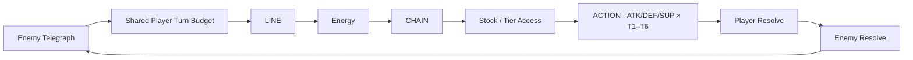
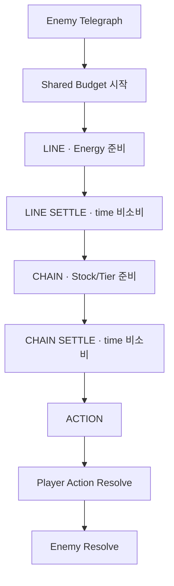

# Tetris Project Home Living GDD IA Implementation Plan

> **For agentic workers:** REQUIRED SUB-SKILL: Use superpowers:subagent-driven-development (recommended) or superpowers:executing-plans to implement this plan task-by-task. Steps use checkbox (`- [ ]`) syntax for tracking.

**Goal:** Rebuild `Tetris · Home` as a self-contained Human Project Living GDD + Visual Dashboard while making the existing Tetris System Record the explicit AI Workspace root, without changing gameplay/visual canon, Draft BUILD PR #19, runtime code, or Human evidence state.

**Architecture:** Keep current GitHub/Notion owner pages as authority and add one machine-readable IA contract plus semantic guard in GitHub. Recompose the Human Home from existing approved design projections, reuse existing Tetris visual references as clearly labeled North-Star material, route operational/schema/evidence detail through the existing System Record, and clean only stale current-facing Notion statements discovered inside this IA scope.

**Tech Stack:** GitHub documentation + Python `unittest` semantic tooling guards + Notion enhanced Markdown/pages + existing Godot/GUT CI regression pipeline.

**Spec:** `docs/superpowers/specs/2026-08-25-project-home-living-gdd-ia-design.md`

## Global Constraints

- Current timing authority remains `TETRIS-TIME-025`: one Shared Player Turn Budget across Line → Chain → Action; READY carries remaining time; settle/forced transition/System Pause/Enemy Resolve do not consume player input budget.
- Current combat authority remains `TETRIS-CORE-024`.
- Current Vanguard skill authority remains `TETRIS-SKILL-026`; Tier 1–6 is tactical Stock commitment, not a linear power ladder.
- Current economy authority remains `TETRIS-BALANCE-027`; Line produces Energy, Chain produces non-interchangeable Stock, Tier N consumes Stock N.
- Current visual authority remains `TETRIS-VISUAL-020 · Tactical Anime Pixel Rift Fantasy`.
- Existing Tetris images are `Visual Reference / North Star` material unless separately promoted through the asset/runtime approval path; this migration does not generate or edit images.
- Human Evidence remains `NOT_RUN`; fun/tension/runtime readability/lower-Tier comprehension/memorable payoff/final tuning remain evidence-dependent.
- Draft Production BUILD PR #19 is read-only and must not be edited, rebased, merged, closed, or promoted to merged-main truth by this work.
- No Production runtime code, gameplay tuning, image-generation pipeline, or paid service/dependency changes.
- Home must not expose raw SHA/PR/workflow/local-path/port/binding logs in its primary design surface.

---

### Task 1: RED machine-readable Project Home IA guard

**Files:**
- Create: `tests/tooling/test_project_home_ia_contract.py`
- Future create: `docs/validation/PROJECT_HOME_LIVING_GDD_IA_CONTRACT.json`

**Interfaces:**
- Consumes: approved design spec above and existing `docs/design/PRODUCTION_CANON_INDEX.json`.
- Produces: a semantic test contract that later tasks must satisfy before Notion migration is considered structurally guarded.

- [ ] **Step 1: Write the failing semantic test**

Create `tests/tooling/test_project_home_ia_contract.py` with this contract:

```python
import json
import unittest
from pathlib import Path


ROOT = Path(__file__).resolve().parents[2]
IA_PATH = ROOT / "docs" / "validation" / "PROJECT_HOME_LIVING_GDD_IA_CONTRACT.json"


class ProjectHomeIaContractTests(unittest.TestCase):
    def test_tetris_home_and_ai_workspace_roles_are_machine_readable(self) -> None:
        self.assertTrue(IA_PATH.is_file(), "project-home IA contract must exist")
        data = json.loads(IA_PATH.read_text(encoding="utf-8"))
        self.assertEqual(data["project"], "TETRIS")
        self.assertEqual(data["human_home_role"], "PROJECT_LIVING_GDD_VISUAL_DASHBOARD")
        self.assertEqual(data["ai_workspace_root"], "EXISTING_TETRIS_SYSTEM_RECORD")
        self.assertEqual(data["visual_authority"], "TETRIS-VISUAL-020")
        self.assertEqual(data["timing_authority"], "TETRIS-TIME-025")
        self.assertEqual(data["skill_authority"], "TETRIS-SKILL-026")
        self.assertEqual(data["balance_authority"], "TETRIS-BALANCE-027")
        self.assertEqual(data["human_evidence_state"], "NOT_RUN")
        self.assertTrue(data["protect_draft_build_pr_19"])
        self.assertIn("PROJECT_NORTH_STAR", data["home_reading_order"])
        self.assertIn("CORE_GAMEPLAY_DATA", data["home_reading_order"])
        self.assertIn("DEVELOPMENT_REALITY", data["home_reading_order"])
        self.assertIn("DETAIL_LIBRARY", data["home_reading_order"])
        self.assertIn("RAW_PR_SHA_CI_LOGS", data["home_forbidden_operational_content"])
        self.assertEqual(data["image_state"], "VISUAL_REFERENCE_NORTH_STAR_NOT_RUNTIME_PROOF")

    def test_home_contract_keeps_visual_gdd_above_link_library(self) -> None:
        data = json.loads(IA_PATH.read_text(encoding="utf-8"))
        order = data["home_reading_order"]
        self.assertLess(order.index("PROJECT_NORTH_STAR"), order.index("DETAIL_LIBRARY"))
        self.assertLess(order.index("HOW_THE_GAME_WORKS"), order.index("DETAIL_LIBRARY"))
        self.assertLess(order.index("HOW_IT_SHOULD_LOOK"), order.index("DETAIL_LIBRARY"))


if __name__ == "__main__":
    unittest.main()
```

- [ ] **Step 2: Run CI/semantic tooling and verify RED is specific**

Trigger the existing PR workflow on PR #22. Expected RED: the two new tests fail because `docs/validation/PROJECT_HOME_LIVING_GDD_IA_CONTRACT.json` does not exist, while pre-existing production-canon/Human-evidence/HiGodot semantic tests remain green. Do not treat unrelated CI/toolchain failures as a valid RED.

- [ ] **Step 3: Record RED evidence on PR #22**

Add a PR conversation comment containing the exact failing head SHA, workflow run ID/number, and the specific missing-contract failure. Do not expose this operational detail on Human Home.

---

### Task 2: GREEN IA contract and design guard

**Files:**
- Create: `docs/validation/PROJECT_HOME_LIVING_GDD_IA_CONTRACT.json`
- Test: `tests/tooling/test_project_home_ia_contract.py`

**Interfaces:**
- Consumes: Task 1 tests.
- Produces: durable machine-readable Human Home / AI Workspace responsibility contract.

- [ ] **Step 1: Create the minimal IA contract**

Create `docs/validation/PROJECT_HOME_LIVING_GDD_IA_CONTRACT.json` exactly around current authority, not new gameplay rules:

```json
{
  "schema_version": 1,
  "project": "TETRIS",
  "human_home_role": "PROJECT_LIVING_GDD_VISUAL_DASHBOARD",
  "ai_workspace_root": "EXISTING_TETRIS_SYSTEM_RECORD",
  "detail_pages_role": "HUMAN_DETAILED_AUTHORITY",
  "github_role": "IMPLEMENTATION_AND_MACHINE_TRUTH",
  "timing_authority": "TETRIS-TIME-025",
  "combat_authority": "TETRIS-CORE-024",
  "skill_authority": "TETRIS-SKILL-026",
  "balance_authority": "TETRIS-BALANCE-027",
  "visual_authority": "TETRIS-VISUAL-020",
  "human_evidence_state": "NOT_RUN",
  "image_state": "VISUAL_REFERENCE_NORTH_STAR_NOT_RUNTIME_PROOF",
  "protect_draft_build_pr_19": true,
  "home_reading_order": [
    "PROJECT_NORTH_STAR",
    "HOW_THE_GAME_WORKS",
    "CORE_GAMEPLAY_DATA",
    "FIRST_6_TO_10_MINUTES",
    "HOW_IT_SHOULD_LOOK",
    "VERTICAL_SLICE_CONTENT_LOCK",
    "DEVELOPMENT_REALITY",
    "DETAIL_LIBRARY"
  ],
  "home_forbidden_operational_content": [
    "RAW_PR_SHA_CI_LOGS",
    "LOCAL_PATHS_PORTS_BINDINGS",
    "MACHINE_SCHEMA_IDS",
    "WORK_LOGS_AND_HANDOFF_RECEIPTS"
  ],
  "ai_workspace_routes": [
    "CURRENT_AUTHORITY",
    "IMPLEMENTATION_EVIDENCE",
    "VALIDATION_EVIDENCE",
    "MACHINE_DETAIL",
    "HANDOFF_AND_PROVENANCE"
  ]
}
```

- [ ] **Step 2: Run semantic tests**

Run existing tooling suite in CI. Expected: new IA tests pass together with the existing production-canon, Human Evidence and HiGodot tests.

- [ ] **Step 3: Commit/review the GREEN contract**

Confirm only documentation/validation/test files changed; no `src/production`, `data/production`, `scenes/production`, or PR #19 branch mutation occurs.

---

### Task 3: Rebuild `Tetris · Home` as the Human Living GDD

**Notion pages:**
- Modify: `Tetris · Home` (`3c41b237-eb1c-8199-85b3-e798e938c80b`)
- Read/source from: `08 · 핵심 시스템 · 상세`, `15 · Vanguard 스킬 · Tactical Tier Matrix`, `16 · Resource Economy · Tier Exposure Contract`, `09 · 대표 전투 · Gatebreaker Encounter`, `11 · Vertical Slice · First Run Flow`, `12 · Vertical Slice · Production Content Lock`, `02 · 비주얼 바이블`, `03 · UI · 퍼즐 전투 Flow Map`, `Vertical Slice · Human Evidence Gate`.

**Interfaces:**
- Consumes: current Notion owner pages and GitHub current authority; owner pages remain authoritative.
- Produces: one human-readable scroll surface matching the eight-section reading order.

- [ ] **Step 1: Read the Notion enhanced Markdown spec and enumerate all current direct child pages**

Fetch `notion://docs/enhanced-markdown-spec`, fetch Home, and search/fetch all direct children before any full-page replacement. Preserve every direct child page/database with exact `<page url="...">` / `<database url="...">` tags if `replace_content` is used.

- [ ] **Step 2: Establish durable visual reuse strategy before moving image blocks**

Do not rely on an expiring signed URL as a long-lived external image source. Prefer preserving/reusing existing Notion-hosted image blocks or creating a durable Notion attachment from the existing source when connector support allows it. Do not generate, edit, restyle, upscale, or reinterpret any image.

The top visual block must use the existing Tetris-specific references, not the cross-project example images:
- Battle Screen Composition / UI North Star reference;
- Frontier Shield Vanguard reference;
- Asymmetric Breach Colossus reference.

Every displayed image must be labeled `Visual Reference / North Star · runtime proof 아님 · 단독 final asset 아님` and the Battle Screen reference must state that `3.2s / 8.4s / 14.0s` enemy ETA-style labels are historical visual residue.

- [ ] **Step 3: Build `01 · PROJECT NORTH STAR`**

At the top of Home show:
- one-line definition: Telegraph first → one Shared Player Turn Budget → Line/Energy → Chain/Stock → tactical Action;
- core player fantasy: read the threat, decide how much time to spend preparing, then commit an ATK/DEF/SUP Technique and immediately see the consequence;
- representative Slice: one Vanguard + one Gatebreaker + one Frontier Gate, 6–10 minute first exposure;
- current style: `Tactical Anime Pixel Rift Fantasy`;
- the three existing Tetris visual references directly in this section.

No raw SHA/PR/CI/runtime metadata appears here.

- [ ] **Step 4: Build `02 · HOW THE GAME WORKS`**

Include two Mermaid diagrams:





Explain READY carry-forward, non-consuming settle, and the five core choices: time allocation, dual-resource preparation, Tier commitment, current-vs-visible-future response, Tempo/result consequence.

- [ ] **Step 5: Build `03 · CORE GAMEPLAY DATA`**

Project current human-relevant data from owner pages:

Resource table:

| Source | Resource | Human role | Constraint |
| --- | --- | --- | --- |
| Line | Energy | Technique throughput / utility cost | Turn 간 보존, Stock과 교환 불가 |
| Chain | Stock | Tier 접근권 / commitment | Turn 간 보존, cap 6, Tier N = Stock N |

Vanguard matrix must show the current eighteen names/roles from `SKILL-026` without adding new effects:
- ATK: Quick Cut / Sweeping Cut / Rift Breach / Crushing Strike / Suppressive Break / Execution Edge.
- DEF: Guard / Fortify / Counter Stance / Bulwark / Rift Ward / Last Bastion.
- SUP: Second Wind / Rally / Haste / Mark Weakness / Rift Seal / Battle Trance.

Gatebreaker table must expose current six representative intents and decision purpose: Light Smash, Gatebreaker Slam, Rift Siphon, Chain Fracture, Rift Repair, Siege Charge. Exact numerical seeds remain labeled `TUNE_REQUIRED` where current owner pages do not establish final tuning.

- [ ] **Step 6: Build `04 · FIRST 6–10 MINUTES`**

Show `Title → Gate Arrival → first real Tutorial Turn → Gatebreaker Live Battle → Result → Fast Retry / next goal`, authored production-board seed principle, contextual non-modal hints, and the emotional/decision arc `read threat → prepare → commit → see payoff → update next plan`.

- [ ] **Step 7: Build `05 · HOW IT SHOULD LOOK`**

Project current visual/HUD truth only:
- `TETRIS-VISUAL-020` style label;
- Focus Stage + Compact Tactical Sidecar;
- hierarchy: Current Telegraph → Shared Timer/current stage → active puzzle/Action → HP/Energy/Stock/Tier → Next Forecast → decorative art/VFX;
- Line vs Chain and Energy vs Stock/Tier use non-color-redundant shape/frame/symbol language;
- ATK/DEF/SUP lane distinction;
- combat art/VFX cannot occlude puzzle cells/Telegraph/timer/cost/Technique states.

Explicitly separate `art taste` from `runtime readability` and keep actual readability evidence `NOT_RUN`.

- [ ] **Step 8: Build `06 · VERTICAL SLICE CONTENT LOCK`, `07 · DEVELOPMENT REALITY`, `08 · DETAIL LIBRARY`**

`06` uses concise Must Build / Not Now tables from the existing Production Content Lock. It describes scope, not progress.

`07` shows only human-readable evidence classes:
- design canon documented/approved;
- visual direction approved as direction/reference, runtime validation pending;
- representative Production runtime not proven on merged main until relevant BUILD merge/readback;
- Human first-exposure validation `NOT_RUN`;
- exact fun/readability/balance evidence-dependent.

Do not show raw SHA/PR/workflow/local tool metadata. Link Production Validation/System Record once.

`08` groups existing detail owners after the self-contained design content: Direction/Scope; Combat/Economy/Skills/Encounter; Visual/UX/Assets/Audio; First Run/Validation; Reference/Benchmark.

- [ ] **Step 9: Read back Home and answer the ten acceptance questions from Home alone**

Read the destination page after persistence. Verify a first-time reader can answer all ten questions from the design spec without opening a child page. If any answer requires a child page, fix the smallest missing projection. Verify no raw PR/SHA/CI/log/local-path metadata leaked into the main Home design surface.

---

### Task 4: Promote the existing Tetris System Record to explicit AI Workspace root

**Notion pages:**
- Modify: Tetris System Record (`3c11b237-eb1c-8187-a81d-fcdeb8d0ef36`)
- Read/link: `Tetris · Home`, Direction, Combat, Visual, Production Validation, Reference/Benchmark owner pages.

**Interfaces:**
- Consumes: current database properties and existing AI/System index.
- Produces: explicit AI Workspace contract without creating another root.

- [ ] **Step 1: Re-fetch System Record and its data-source schema before property edits**

Preserve existing database properties. Do not alter local binding/runtime values without fresh local evidence.

- [ ] **Step 2: Replace/expand the in-page AI section with `AI WORKSPACE · TETRIS`**

The section must explicitly route:
- Human Home;
- current authority routing;
- implementation evidence;
- validation evidence;
- machine detail/schema/mapping/IDs/tool binding/local execution metadata;
- handoff/provenance and unresolved gates.

Include this explicit future-agent rule: `Do not create another Tetris AI Workspace root unless this System Record lacks a required capability.`

- [ ] **Step 3: Preserve operational truth and evidence ceilings**

System Record, not Home, keeps exact main SHA, open PR state, Sync State, runtime state, local tool metadata, and Human evidence state. Keep `Godot Runtime State = NOT_RUN` and `Human Evidence = NOT_RUN` unless new receipts actually exist.

- [ ] **Step 4: Read back the System Record**

From the System Record alone, verify an AI can locate current gameplay authority, visual authority, machine indexes, implementation evidence, Human evidence gate/state, protected open PR state, local tool metadata, and detail owner pages.

---

### Task 5: Clean stale current-facing Notion statements inside IA scope

**Notion pages to verify first:**
- `08 · 핵심 시스템 · 상세`
- `06 · Production · Handoff`
- `12 · Vertical Slice · Production Content Lock`
- any additional page returned by targeted workspace search for stale current terms.

**Interfaces:**
- Consumes: current GitHub main/System Record and owner-page readback.
- Produces: no known current-facing contradiction that would misroute a future human/AI.

- [ ] **Step 1: Search before editing**

Search Tetris Notion scope for these patterns/meanings:
- `현재 open PR은 없습니다` / `current open PR: NONE`;
- old current `TETRIS-SKILL-022` owner wording;
- independent `30/30/30`, `각 Phase timer`, `unused time discard` presented as current rather than historical;
- old main SHA/current BUILD-deferred statements presented as live operational truth;
- current reference images described as final/approved runtime assets.

- [ ] **Step 2: Correct only stale current-facing text**

Use smallest targeted `update_content` replacements. Preserve historical/provenance passages when clearly labeled historical. Do not rewrite old decision history merely to make it look current.

Known minimum fixes:
- `08 · 핵심 시스템 · 상세`: any current Turn summary must say one Shared Player Turn Budget; current Skill authority must route to `SKILL-026`, not `SKILL-022`.
- `06 · Production · Handoff`: replace stale current main/open-PR/build-state claims with a pointer to System Record for live operational truth; preserve historical PR #12 receipt as provenance.
- `12 · Production Content Lock`: remove live claim that there is no open PR; state that implementation progress/open PRs are operational evidence owned by System Record/Production Validation and do not change Slice scope.

- [ ] **Step 3: Read back each corrected page**

Confirm current and historical statements are clearly separated, no new gameplay rule was introduced, and PR #19 was not mutated.

---

### Task 6: Create migration readback receipt and run full verification

**Files:**
- Create: `docs/operations/notion-project-ia/2026-08-25_TETRIS_LIVING_GDD_HOME_READBACK.md`
- Test: `tests/tooling/test_project_home_ia_contract.py`

**Interfaces:**
- Consumes: completed Notion readbacks and Task 2 IA contract.
- Produces: durable repository evidence of what was actually migrated and what remains unproven.

- [ ] **Step 1: Write the readback receipt**

Record:
- Human Home page ID/URL and final section order;
- System Record page ID/role;
- detail pages corrected;
- visual reference state and no-image-generation statement;
- current authority IDs;
- Human evidence `NOT_RUN`;
- Production runtime evidence ceiling;
- PR #19 isolation state at readback time;
- exact branch head used for final CI.

Do not copy secrets/local credentials. Local paths/ports may remain in System Record but are not needed in the repository receipt.

- [ ] **Step 2: Run exact-head CI**

Require:
- all tooling semantic tests PASS, including new IA tests;
- Godot 4.7.1 import/parse PASS;
- strict GUT guard PASS;
- historical/merged-main GUT regression PASS;
- Windows PowerShell contract PASS.

This IA work does not claim Production runtime/Human playtest PASS from these automated checks.

- [ ] **Step 3: Compare branch to current `main` and re-query PR #19**

Verify changed GitHub files are only design/plan/validation/readback/test artifacts. Re-query PR #19 and confirm it remains open Draft/unmerged at the same head unless an external actor changed it; if changed externally, report the new state but do not mutate it.

---

### Task 7: Adversarial review, merge and post-merge operational readback

**GitHub/Notion:**
- PR #22
- `main`
- Issue #10
- Tetris System Record

**Interfaces:**
- Consumes: exact-head GREEN from Task 6.
- Produces: merged IA guard/readback with Notion and repository operational truth synchronized.

- [ ] **Step 1: Run at least five whole-state adversarial loops**

After the last material correction, reset clean-loop count and run five complete loops:
1. authority/duplication: Home projection vs detail canon vs GitHub machine truth;
2. Human readability: can Home alone explain identity → gameplay → data → flow → visual → scope → evidence;
3. Visual status: North-Star/reference vs final asset/runtime proof, old ETA residue quarantined;
4. AI Workspace/evidence: System Record routes schema/PR/test/runtime/Human evidence without operational leakage into Home;
5. maintainability/protection: stale-current search, zero new service cost, reversibility, PR #19 isolation.

Any material finding requires the smallest correction, re-readback, regression CI, and clean-loop reset.

- [ ] **Step 2: Update PR #22 evidence and mark ready**

PR body/comment must state exact GREEN head, CI run, Notion readback, stale cleanup, final clean loops, IRG evidence ceiling, and PR #19 isolation.

- [ ] **Step 3: Squash merge with expected head SHA**

Use `expected_head_sha` so the merge is rejected if the branch moved after verification.

- [ ] **Step 4: Verify post-merge `main` and push CI**

Read the `main` branch SHA, fetch the exact merged files from `main`, and verify the push-triggered workflow for the merge SHA completes successfully.

- [ ] **Step 5: Update System Record operational properties and Issue #10**

Only after post-merge readback:
- update `Repo Main SHA` and increment `Revision`;
- keep `Sync State` conservative if local tool/runtime binding remains unverified;
- keep Human/runtime `NOT_RUN` states honest;
- append Issue #10 with the Living GDD Home/AI Workspace architecture merge, current main, and PR #19 isolation.

- [ ] **Step 6: Final destination readback**

Re-fetch Home and System Record once more. Final report must distinguish:
- what changed in information architecture;
- what current design data became visible on Home;
- what remains AI/System-only;
- what remains runtime/Human-unproven;
- what was deliberately not changed.
